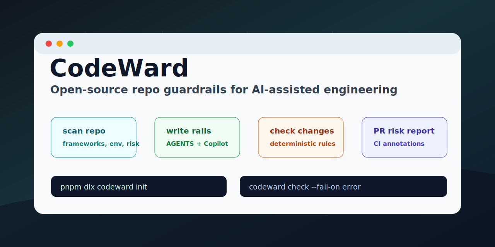

<p align="center">
  
</p>

# CodeWard

**AI destekli yazılım ekipleri için açık kaynak repo guardrail katmanı.**

CodeWard, herhangi bir repoyu AI coding agent'lar için production'a daha hazır ve güvenli bir çalışma alanına çevirir. Kod tabanını analiz eder, `AGENTS.md` ve `.github/copilot-instructions.md` gibi repo-aware instruction dosyaları üretir ve AI-generated kod production'a yaklaşmadan önce pull request risklerini kontrol eder.

**Diller:** [English](README.md) | [中文](README.zh-CN.md) | [Français](README.fr.md) | Türkçe

## Neden CodeWard

AI coding agent'lar hızlı. Production codebase'ler ise hala disipline ihtiyaç duyar.

CodeWard ekiplerin şunları tanımlayıp enforce etmesine yardım eder:

- repo'ya özel agent talimatları
- mimari ve ownership sınırları
- validation komutları
- riskli dosya politikaları
- security-sensitive kontroller
- pull request guardrail'leri
- issue'dan agent task pack üretimi
- konfigüre edilebilir deterministic kurallar

CodeWard, Cursor, Claude Code, Codex, Copilot veya başka coding agent'ların yerine geçmez. Onlara daha sağlam raylar döşer.

## Nasıl Çalışır

```txt
analyze repo -> generate instruction files -> enforce policy -> produce PR risk report
```

CodeWard v0.1, LLM veya API key olmadan da faydalıdır.

| Yetenek | Çıktı |
| --- | --- |
| Repo scan | Framework, package manager, script, env kullanımı, riskli path, route ve test tespiti |
| Instruction dosyaları | Repo-aware `AGENTS.md` ve `.github/copilot-instructions.md` |
| Deterministic checks | Eksik instruction, env drift, dependency değişimi, riskli path, test eksiği, explicit `any`, silent `catch` |
| GitHub Action | PR annotation'ları ve fail-on-error politikası |
| Task packs | Issue metninden agent-ready uygulama brief'i |

## Hızlı Başlangıç

```bash
pnpm install
pnpm build
pnpm check
```

Örnek repo üzerinde dene:

```bash
pnpm codeward init --root examples/next-prisma-saas
pnpm codeward scan --root examples/next-prisma-saas
pnpm codeward check --root examples/next-prisma-saas --no-fail
```

Yayınlandıktan sonra herhangi bir repoda:

```bash
pnpm dlx codeward init
pnpm dlx codeward scan
pnpm dlx codeward agents --target agents,copilot --write
pnpm dlx codeward check
```

## CLI

```txt
codeward init      Instruction dosyaları, .codeward/config.yml, repo-map ve CI workflow üretir
codeward scan      Machine-readable repo context basar
codeward agents    AGENTS.md ve Copilot instruction dosyalarını üretir
codeward check     Deterministic production guardrail kontrollerini çalıştırır
codeward ci        GitHub uyumlu çıktı üretir
codeward task      Issue metnini agent-ready task pack'e çevirir
```

## Geliştirme

```bash
pnpm lint
pnpm typecheck
pnpm test
pnpm build
pnpm check
```

## Lisans

Apache-2.0.
