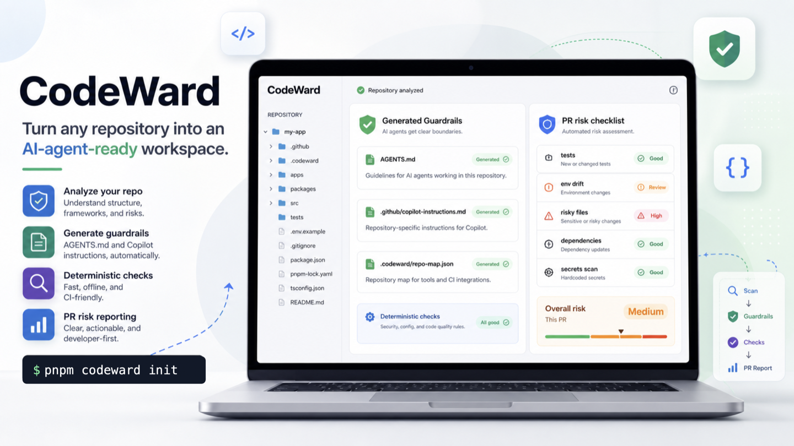

<p align="center">
  
</p>

# CodeWard

**面向 AI 辅助工程的开源仓库护栏。**

CodeWard 会把任何代码仓库变成更适合 AI 编码代理工作的生产级工作区。它分析代码库，生成仓库感知的指令文件，例如 `AGENTS.md` 和 `.github/copilot-instructions.md`，并在 AI 生成的代码进入生产环境之前检查 pull request 的风险。

**语言:** [English](README.md) | 中文 | [Français](README.fr.md) | [Türkçe](README.tr.md)

## 为什么需要 CodeWard

AI 编码代理很快，但生产代码库仍然需要纪律。

CodeWard 帮助团队定义并执行：

- 仓库专属的代理指令
- 架构和所有权边界
- 验证命令
- 高风险文件策略
- 安全敏感检查
- pull request 护栏
- issue 到 agent task pack 的转换
- 可配置的确定性规则

CodeWard 不替代 Cursor、Claude Code、Codex、Copilot 或其他编码代理。它为这些工具提供更可靠的轨道。

## 工作流

```txt
analyze repo -> generate instruction files -> enforce policy -> produce PR risk report
```

CodeWard v0.1 不需要 LLM 或 API key 也能工作。

| 能力 | 结果 |
| --- | --- |
| 仓库扫描 | 检测框架、包管理器、脚本、环境变量、高风险路径、路由和测试 |
| 指令文件 | 生成仓库感知的 `AGENTS.md` 和 `.github/copilot-instructions.md` |
| 确定性检查 | 缺失指令、环境变量漂移、依赖变更、高风险路径、缺少邻近测试、显式 `any`、空 `catch` |
| GitHub Action | PR annotations 和 fail-on-error 策略 |
| Task packs | 把 issue 文本转换成适合 AI 代理执行的任务说明 |

## 快速开始

```bash
pnpm install
pnpm build
pnpm check
```

打开 Vite 产品界面：

```bash
pnpm dev:web
```

在示例仓库上试用：

```bash
pnpm codeward init --root examples/next-prisma-saas
pnpm codeward scan --root examples/next-prisma-saas
pnpm codeward check --root examples/next-prisma-saas --no-fail
```

从当前 checkout 对另一个本地仓库运行 CodeWard：

```bash
pnpm codeward init --root /path/to/repo
pnpm codeward scan --root /path/to/repo
pnpm codeward agents --root /path/to/repo --target agents,copilot --write
pnpm codeward check --root /path/to/repo
```

## CLI

```txt
codeward init      创建指令文件、.codeward/config.yml、repo-map 和 CI workflow
codeward scan      输出机器可读的仓库上下文
codeward agents    生成 AGENTS.md 和 Copilot 指令
codeward check     运行确定性的生产护栏检查
codeward ci        输出适合 GitHub 的检查结果
codeward task      把 issue 文本转换成 agent-ready task pack
```

## 开发

```bash
pnpm lint
pnpm typecheck
pnpm test
pnpm build
pnpm check
```

## License

Apache-2.0.
